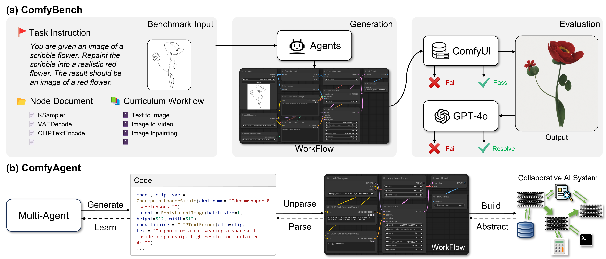
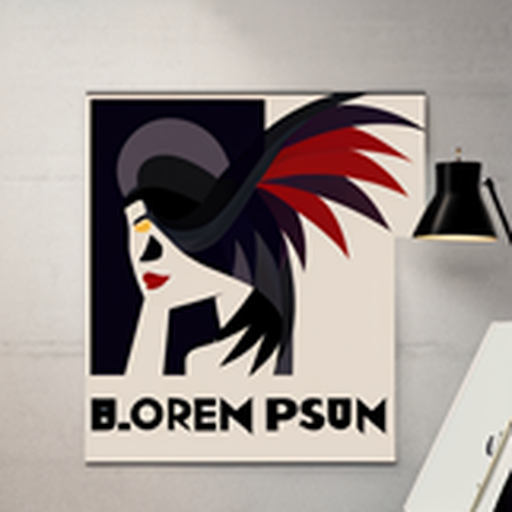
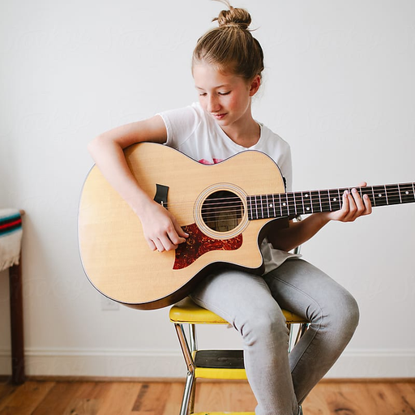
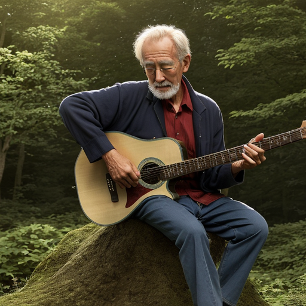
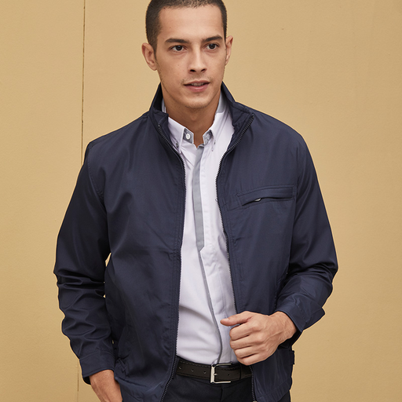
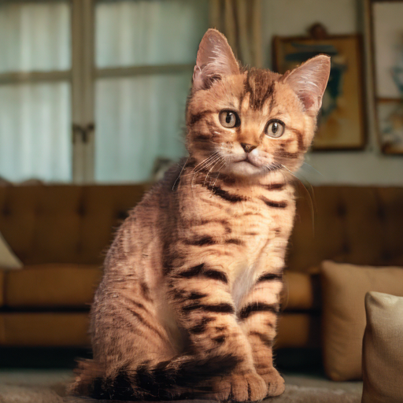

<h1 align="center">
ComfyBench: Benchmarking LLM-based Agents in ComfyUI for Autonomously Designing Collaborative AI Systems
</h1>
<p align="center">
    Implementation for the paper "ComfyBench: Benchmarking LLM-based Agents in ComfyUI for Autonomously Designing Collaborative AI Systems".
    <br />
    <a href="https://github.com/xxyqwq/"><strong>Xiangyuan Xue</strong></a>
    &nbsp;
    <a href="https://github.com/whlzy/"><strong>Zeyu Lu</strong></a>
    &nbsp;
    <a href="https://dihuang.me/"><strong>Di Huang</strong></a>
    &nbsp;
    <a href="https://github.com/wzdthu/"><strong>Zidong Wang</strong></a>
    &nbsp;
    <a href="https://wlouyang.github.io/"><strong>Wanli Ouyang</strong></a>
    &nbsp;
    <a href="http://leibai.site/"><strong>Lei Bai</strong></a>*
    <br />
</p>
<p align="center">
    <a href="https://github.com/xxyQwQ/ComfyBench">  </a>
    <a href="https://xxyqwq.github.io/ComfyBench">  </a>
    <a href="https://arxiv.org/abs/2409.01392">  </a>
</p>



(a) **ComfyBench** is a comprehensive benchmark to evaluate agents's ability to design collaborative AI systems in ComfyUI. Given the task instruction, agents are required to learn from documents and create workflows to describe collaborative AI systems. The performance is measured by *pass rate* and *resolve rate*, reflecting whether the workflow can be correctly executed and whether the task requirements are realized. (b) **ComfyAgent** builds collaborative Al systems in ComfyUI by generating workflows. The workflows are converted into equivalent code so that LLMs can better understand them. ComfyAgent can learn from existing workflows and autonomously design new ones. The generated workflows can be interpreted as collaborative AI systems to complete given tasks.

## 📰 News

- **[2024/11/20]** The latest version of our code is updated.
- **[2024/11/14]** The work is further extended and renamed as *ComfyBench*.
- **[2024/09/04]** Our code implementation is released on GitHub.
- **[2024/09/02]** The initial version of our paper is submitted to arXiv.

## ⚙️ Configuration

First, clone the repository and navigate to the project directory:

```bash
git clone https://github.com/xxyQwQ/ComfyBench
cd ComfyBench
```

Then, create a new conda environment and install the dependencies:

```bash
conda create -n comfybench python=3.12
conda activate comfybench
pip install -r requirements.txt
```

Finally, modify `config.yaml` to set your ComfyUI server and API key. Feel free to change proxies and models if necessary.

⚠️ Before executing the workflows, prepare your ComfyUI with necessary models and extensions.

Despite some models can be automatically installed, other models need to be manually downloaded and placed in the specific directory. You may find them by yourself on [Hugging Face](https://huggingface.co/) or directly download from our [Cloud Drive](https://pan.baidu.com/s/1z83-XnoHcnMz6y0At2i_iw?pwd=1120). Besides, we provide a list of extensions in `assets/extension.md` so that you can install them manually. You can verify the completeness with the workflows in `dataset/benchmark/workflow`.

## 🚀 ComfyAgent Execution

Run the following commands to execute the ComfyAgent pipeline:

```bash
# activate the conda environment
conda activate comfybench

# execute the main script
# see `main.py` for more parameter settings
python main.py \
    --instruction "task-instruction" \
    --agent_name "comfy" \
    --save_path "path/to/save/result"
```

The log file together with the workflow will be saved in the specified path. If your ComfyUI server is working properly, the workflow will be executed automatically to produce the result.

## 📊 ComfyBench Evaluation

ComfyBench is provided under `dataset/benchmark`. The `document` folder contains documentation for 3205 nodes, where `meta.json` records the metadata of each node. The `workflow` folder contains 20 curriculum workflows for agents to learn from. The `instruction` provides all the tasks in ComfyBench, where `complete.json` contains 200 task instructions and `sample.json` contains a subset of 10 task instructions for validation.

Before evaluating on ComfyBench, you should copy the resource files in `dataset/benchmark/resource` into the input folder of ComfyUI, so that ComfyUI can load them during the workflow execution. Then you can evaluate the specific agent by running the following commands. Here we take ComfyAgent as an example.

```bash
# activate the conda environment and set up environment variables
conda activate comfybench
export PYTHONPATH=./

# execute the inference script
# see `script/inference.py` for more parameter settings
python script/inference.py \
    --agent_name "comfy" \
    --save_path "cache/benchmark/comfy"

# execute the evaluation script
# see `script/evaluation.py` for more parameter settings
python script/evaluation.py \
    --submit_folder "cache/benchmark/comfy/workflow" \
    --cache_path "cache/benchmark/comfy/outcome"
```

In this example, the log files and generated workflows will be saved in `cache/benchmark/comfy/logging` and `cache/benchmark/comfy/workflow`, respectively. The produced results will be saved in `cache/benchmark/comfy/outcome`, together with a `result.json` recording whether each task is passed and resolved, and a `summary.txt` summarizing the overall metrics.

## 🎬 Gallery

Here are some examples of the results produced by ComfyAgent on ComfyBench. Visit our [Project Page](https://xxyqwq.github.io/ComfyBench) for more details.

| Task Instruction                                             |                 Input                 |                 Result                  |
| ------------------------------------------------------------ | :-----------------------------------: | :-------------------------------------: |
| *Generate an image of a hot air balloon floating over a scenic valley at sunrise. The result should be a high-quality image.* |                  N/A                  |  |
| *Generate an image of a modern city skyline at night with illuminated skyscrapers. The result should be a high-quality image.* |                  N/A                  |  |
| *You are given an image of a scribble flower. Repaint the scribble into a realistic red flower. The result should be an image of a red flower.* |  |  |
| *You are given an image of a red apple. Change it into a green apple on a table while maintaining other details. The result should be an image of a green apple.* |  |  |
| *You are given an image of a sample logo containing a bird pattern. Convert it into a cubist art poster with dark colors. The result should be an image of a poster without watermark.* |  |  |
| *You are given an image of a large castle standing on top of a hill. Convert the castle into the style of ice cream while maintaining its original structure. The result should be an image with the castle transformed into a colorful and fantastic ice cream castle.* |  |  |
| *You are given a low-resolution photo of a crowd of people. Upscale the image by 4x. The result should be a high-resolution version of the image.* |  |  |
| *You are given an image of a table filled with dishes. Remove the fork on the table. The result should be a high-quality image without visible artifacts.* |  |  |
| *You are given an image of a red car parked on the street. Replace the tree behind the car with a white house. The result should be a high-quality image without visible artifacts.* |  |  |
| *You are given an image of a red bridge with a person standing on it. Remove the person from the image while maintaining the original appearance of the bridge. The result should be a high-quality image without visible artifacts.* |  |  |
| *You are given a photo of mountains and rivers with a visible watermark in the bottom right corner. Remove the watermark from the image while maintaining the quality and content of the original photo. The result should be a high-quality image without the watermark.* |  |  |
| *You are given an image of a girl playing the guitar. Generate an image of an old man playing the guitar in a forest with the same pose as the girl. The result should be a realistic image of an old man playing the guitar.* |  |  |
| *You are given an image of a man wearing a black jacket. Change the black jacket into a white hoodie while ensuring that the modification looks natural and realistic. The result should be a high-quality image of the man wearing a white hoodie.* |  |  |
| *You are given an image of a male celebrity. Transform the man in the image into a beautiful woman with ponytail hair while preserving her facial identity. The result should be a high-quality image of the woman.* |  |  |
| *You are given an image of a toy dog. Replace the background with a scene of a sunny park with green grass while keeping the lighting and shadows consistent. The result should be an image of the toy dog in the park scene.* |  |  |
| *You are given an image of a standing cat. Replace the background with a scene of a cozy living room while keeping the lighting and shadows consistent. The result should be an image of the cat in the living room scene.* |  |  |
| *You are given an image containing two bottles of cosmetic products illuminated by a soft yellow light. Modify the illumination into a bright pink light to create a more vibrant and attractive appearance. The result should be an image of the cosmetic products with the new illumination.* |  |  |

## 📜 Citation

If you find our work helpful, please consider citing our paper:

```bibtex
@article{xue2024comfybench,
  title={ComfyBench: Benchmarking LLM-based Agents in ComfyUI for Autonomously Designing Collaborative AI Systems},
  author={Xue, Xiangyuan and Lu, Zeyu and Huang, Di and Wang, Zidong and Ouyang, Wanli and Bai, Lei},
  journal={arXiv preprint arXiv:2409.01392},
  year={2024}
}
```
